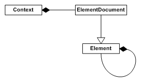
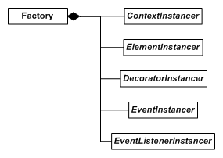

现在你已经将 RmlUi 集成了到你的应用程序中，但是你应该如何使用它呢？这是对 RmlUi 核心的重要概念和对象的概览。

### 所有权与生命周期

RmlUi 使用智能指针来声明所有权。为了与库的命名方案保持一致，声明了以下别名：
```cpp
template<typename T> using UniquePtr = std::unique_ptr<T>;
template<typename T> using SharedPtr = std::shared_ptr<T>;
```

所有原始指针都是非拥有型的，永远不要对库返回的对象调用 `delete`！可能的例外是使用自定义 [instancer](#the-factory-and-instancers) 并且之前已对同一对象使用了 `new` 运算符。

用户创建的接口通常通过非拥有的原始指针提交给库并存储。这意味着处理接口的生命周期是用户的责任。通常，接口必须保持存活直到调用 `Rml::Shutdown` 之后，然后再进行清理。所有相关函数都注释了其生命周期要求。

在大多数情况下，库返回非拥有的原始指针。然而在少数情况下，会返回 unique 或 shared 指针，从而将所有权交给用户。这些对象随后可以再次移动或复制到库中。否则，它们的析构函数会在超出作用域时清理对象。

由于原始指针是非拥有型的，其底层资源原则上可能随时被释放。因此，必须小心避免与被释放的资源交互，因为这会导致未定义行为。例如，当从父元素释放元素时，其所有后代也会一并释放。相应地，指向被移除元素的所有原始指针都会失效。更多关于[元素所有权的内容请参阅此处](elements.html#ownership-of-elements)。

元素和其他一些对象可以生成 `Rml::ObserverPtr<T>`。观察者指针可以通过告知其用户被观察对象已被销毁来帮助管理生命周期问题。
```cpp
Rml::Element* element = document->GetElementById("content");
Rml::ObserverPtr<Rml::Element> observer = element->GetObserverPtr();
// ...
if (observer) {
	// Will only enter if object is still alive.
	observer->SetClass("celebrate", true);
}
```

### 元素层级



#### 元素

元素，由 `Rml::Element` 对象表示，是一个单独的界面元素，通常可以在文档中找到。当从 [RML](../rml.html) 文件加载文档时，每个 RML 标签都会在文档中创建一个元素。

元素要么是矩形的，要么由一系列矩形组成。元素是层级结构的一部分，每个元素有一个父元素和任意数量的有序子元素。每个子元素可能位于其父元素内部，也可能不位于其中。

元素通过[样式系统](rcss.html)被赋予 [RCSS](../rcss.html) 属性。这些属性决定了元素的大小、布局和图形表示，以及元素上的任何[装饰器](decorators.html)。

当对元素执行某些操作时，元素会发送[事件](events.html)。应用程序可以订阅元素，以便在该元素上发生事件时得到通知。所有元素都会发送鼠标操作事件（`hover`{:.evt}、`click`{:.evt}、`double-click`{:.evt} 等）以及输入焦点变化事件（`focus`{:.evt}、`blur`{:.evt}）。派生元素还可以发送更多事件。

元素的功能可以通过派生自 `Rml::Element` 类来扩展（例如[元素包](element_packages.html)中的元素）。应用程序可以派生自己的自定义元素。

如果将 RmlUi 与 HTML 进行比较，RmlUi 元素类似于 HTML 页面中的节点。

#### 文档

文档，由 `Rml::ElementDocument` 对象表示，本身就是一个元素，并且是文档元素层级的根。文档通常存在于上下文之中。文档在上下文中分层排列，并且可以被强制放入特定的层（即，固定到背景或前景）。

RmlUi 文档类似于 Web 浏览器中的 HTML 页面。

#### 上下文

每个上下文，由 `Rml::Context` 对象表示，是一个独立的文档集合。每个上下文都有自己的大小并维护自己的输入状态；这包括鼠标光标位置、焦点元素和悬停元素。上下文可以由应用程序自行决定，彼此独立地进行更新、渲染和接收用户输入。

RmlUi 上下文类似于包含多个 HTML 页面的单个桌面，每个页面都在自己的窗口中。

### 属性与样式表

属性是附加到元素上的、具有给定值范围的命名属性。属性的规范由 RmlUi 定义，尽管应用程序也可以定义新属性。每个元素对每个可用属性都有一个值；除非显式设置，否则这些值将是属性的默认值。属性影响元素的布局、格式化和装饰。

[样式表](rcss.html)包含属性声明组和用于选择性地将这些组应用于文档中元素的规则。样式表通常包含在单独的文件中，或在 RML 文件中以内联方式声明。

RCSS 属性类似于 HTML 元素上的 CSS 属性。

### 计算值

大多数内置属性都有对应的计算值。这个概念类似于 CSS 计算值，也就是说，计算值会在布局执行之前将所有属性转换为最基础的单位。例如，长度百分比值通常被转换为像素或百分比。给定元素的计算值在 `Context::Update` 调用期间计算。

### 装饰器

[装饰器](decorators.html)是设计用于附加到元素以渲染任意效果的对象。RmlUi 附带几个内置装饰器，应用程序可以通过派生自装饰器接口 `Rml::Decorator` 来创建自己的装饰器。装饰器的附加和自定义已内置在属性系统中。

### Factory 与 instancer

RmlUi 所有可以被自定义的对象（元素、文档、上下文、装饰器、事件和事件监听器）都是通过 factory `Rml::Factory` 使用特定的 instancer 类型构造的。



Instancer 是能够创建和销毁具体 RmlUi 对象的抽象类型。它们在其各自的类型文档中一并说明。