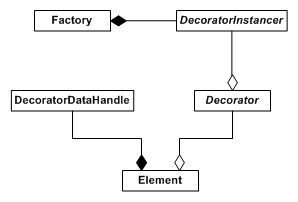

装饰器是通用的、可配置的、可重用的对象，设计用于附加到元素上，以在其表面添加自定义渲染效果。装饰器渲染在元素的边框和背景之上。关于装饰器如何通过 RML 附加到元素并进行配置的完整描述，请参阅 [RCSS 文档中的相关章节](../rcss/decorators.html)。

### 装饰器概览

RmlUi 附带几个内置装饰器，从显示单个图像、平铺图像到渐变。取决于你希望元素看起来有多花哨，你可能需要开发自定义装饰器。自定义装饰器的定义和实例化方式与自定义元素类似。需要创建一个派生自 `Rml::Decorator` 的自定义装饰器类，并在 RmlUi factory 中为其注册一个 instancer。

为了优化内存使用，装饰器在适当的情况下会在元素之间共享。对于它拥有的每个装饰器，元素维护一个指向任意元素特定数据的句柄，装饰器可以在需要时生成这些数据。例如，考虑由以下 RML 生成的文档。

```html
<rml>
<head>
	<style>
		button
		{
			decorator: image( button.png );
		}
	</style>
</head>
<body>
	<button id="restart">Restart</button>
	<button id="restore">Restore</button>
	<button id="quit">Quit</button>
</body>
</rml>
```

这里，只会实例化一个实际的装饰器；该装饰器将在所有三个 `button`{:.tag} 元素之间共享。整个装饰器系统如下所示：



### 自定义装饰器

如果你需要超出内置装饰器所能提供的自定义装饰效果，你可以轻松创建自定义装饰器来满足你的需求。

#### 创建自定义装饰器

所有自定义装饰器都是派生自（不一定直接派生）`Rml::Decorator` 的类。自定义装饰器中有三个需要覆盖的虚函数：

```cpp
// Called on a decorator to generate any required per-element data for a newly decorated element.
// @param[in] element The newly decorated element.
// @param[in] paint_area Determines the element's area to be painted by the decorator.
// @return A handle to a decorator-defined data handle, or zero if no data is needed for the element.
virtual Rml::DecoratorDataHandle GenerateElementData(Rml::Element* element, BoxArea paint_area) = 0;

// Called to release element data generated by this decorator.
// @param[in] element_data The element data handle to release.
virtual void ReleaseElementData(Rml::DecoratorDataHandle element_data) = 0;

// Called to render the decorator on an element.
// @param[in] element The element to render the decorator on.
// @param[in] element_data The handle to the data generated by the decorator for the element.
virtual void RenderElement(Rml::Element* element,
                           Rml::DecoratorDataHandle element_data) = 0;
```

`GenerateElementData()` 将由使用该装饰器的元素在首次渲染之前以及每次调整大小时调用。如果装饰器需要为使用它的每个元素存储数据，它可以在此函数中生成数据并返回其句柄。DecoratorDataHandle 与所有句柄类型一样，是指针大小的类型。如果不需要数据，则返回零（0）。因此，请确保对于你的装饰器，0 不是有效的句柄！

当元素需要释放装饰器为其生成的非零数据句柄时，会调用 `ReleaseElementData()`。装饰器应释放为数据句柄分配的任何资源。

每当元素希望装饰器在其上渲染装饰时，每一帧都会调用 `RenderElement()`。它将自身以及装饰器之前为其生成的数据句柄传递进去；如果没有生成数据，这将为零。装饰器可以在这里自由执行任何必要的渲染代码。请记住，此时将根据元素适当地设置裁剪区域；如果你想在元素的边框区域之外渲染，则需要禁用它。如果这样做，请记得在适当时重新启用它，否则 RmlUi 可能会渲染被裁剪的内容。

#### 生成几何体

自定义装饰器不需要通过 RmlUi 的渲染管理器渲染其几何体。装饰器可能希望直接与其应用程序的渲染器对话，以完全访问其原生能力，例如片段着色器和渲染纹理，从而实现高级效果。然而，如果你只需要这些，为了简单起见，你可能希望通过渲染管理器渲染。

在 RmlUi 中，几何体首先构造成 `Rml::Mesh` 结构体。该结构体由顶点和索引列表组成。`RmlUi/Core/MeshUtilities.h`{:.incl} 头文件中有几个有用的函数可以帮助构建，例如生成四边形、线条、背景和边框。例如，以下代码将生成一个红色的背景网格，使用元素的 `border-radius`{:.prop} 制作圆角背景，并使用从 `GenerateElementData()` 函数传入的绘制区域。

```cpp
Rml::ColourbPremultiplied color(255, 0, 0);
Rml::Vector4f border_radius = element->GetComputedValues().border_radius();
Rml::Mesh mesh;
Rml::MeshUtilities::GenerateBackground(mesh, element->GetBox(), Rml::Vector2f(0, 0), border_radius, color, paint_area);
```

RmlUi 在内部使用 `Geometry` 类来存储和渲染生成的几何体。每个几何对象都有一个顶点缓冲区、一个索引缓冲区和一个可选纹理。自定义装饰器可以在每个装饰器句柄中存储一个或多个几何对象。

你也可以直接操作顶点和索引。

```cpp
Rml::Vector<Rml::Vertex>& vertices = mesh.vertices;
Rml::Vector<int>& indices = mesh.indices;

Rml::Vertex vertex;
vertex.colour = {200, 150, 150, 200};
vertex.tex_coord = {0, 0};

vertex.position = {0, 0};
vertices.push_back(vertex);
vertex.position = {0, 68};
vertices.push_back(vertex);
vertex.position = {42, 68};
vertices.push_back(vertex);
vertex.position = {42, 0};
vertices.push_back(vertex);

indices = {0, 1, 2, 0, 2, 3};
```

网格完成后，可以使用*渲染管理器*将其转换为 `Rml::Geometry`。几何类是唯一的渲染资源，它通过渲染接口自动处理底层几何资源在渲染器上的生成和释放。

```cpp
Rml::Geometry geometry = element->GetRenderManager()->MakeGeometry(std::move(mesh));
```

几何对象拥有网格的所有权并使其保持存活，以便可以引用网格数据并根据需要用于重新生成底层几何资源。因此，必须将网格移入几何构造函数。如果你需要网格的本地副本，则需要显式复制一份。

要渲染几何体，请调用其 `Render()` 函数。它接受一个平移参数来调整几何体渲染的位置。

```cpp
Rml::Vector2f offset = element->GetAbsoluteOffset(Rml::BoxArea::Border);
geometry.Render(offset);
```

#### 创建自定义装饰器 instancer

装饰器的 instancer 负责定义和处理可用于配置装饰器的样式属性（property）。虽然你可以创建没有任何样式属性的自定义装饰器，但我们建议你将所有变量暴露给 RCSS。这既快速又简单，而且你会得到更灵活的装饰器。

装饰器 instancer 需要派生自 `Rml::DecoratorInstancer`。需要覆盖以下纯虚函数：

```cpp
// Instances a decorator given the property tag and attributes from the RCSS file.
// @param[in] name The type of decorator desired. For example, "decorator: simple(...);" is declared as type "simple".
// @param[in] properties All RCSS properties associated with the decorator.
// @param[in] instancer_interface An interface for querying the active style sheet.
// @return A shared_ptr to the decorator if it was instanced successfully.
virtual Rml::SharedPtr<Rml::Decorator> InstanceDecorator(const Rml::String& name,
                                                         const Rml::PropertyDictionary& properties,
                                                         const Rml::DecoratorInstancerInterface& interface) = 0;
```

每当需要使用此 instancer 创建装饰器时，都会调用 `InstanceDecorator()`。它传入 `name`（创建装饰器时使用的名称）、`properties`（RCSS 规则为装饰器定义的样式属性字典，见下文）以及 `interface`（一个接口，用于帮助构造装饰器所需的任何资源，例如构造纹理和获取精灵图）。

属性字典将包含装饰器属性规范中每个属性的条目；如果在 RCSS 中没有指定值，那么默认值将自动放入字典中。

构造装饰器后，将其作为共享指针返回。如果装饰器未成功创建，返回 `nullptr` 表示错误，那么任何元素都将忽略它。

#### 定义装饰器的样式属性（property）

每个装饰器 instancer 都持有其创建的装饰器的完整样式属性（property）规范。在其构造函数中，自定义 instancer 可以通过使用受保护的函数 `RegisterProperty()` 和 `RegisterShorthand()` 来向规范中添加样式属性和简写。有关定义样式属性的详细文档，请参阅[注册用户自定义属性](rcss.html#user-defined-properties)的文档。请注意，使用 `Rml::StyleSheetSpecification` 注册的[用户自定义属性解析器](rcss.html#user-defined-value-parsers)可以用于装饰器属性规范。

以下是一个定义简单属性规范的装饰器示例：

```cpp
CustomDecoratorInstancer::CustomDecoratorInstancer() : Rml::DecoratorInstancer()
{
	property_id1 = RegisterProperty("custom-property-1", "1").AddParser("number").GetId();
	property_id2 = RegisterProperty("custom-property-2", "auto").AddParser("number")
	                                                            .AddParser("keyword", "auto, none")
	                                                            .GetId();
	RegisterShorthand("decorator", "custom-property-1, custom-property-2", Rml::ShorthandType::FallThrough);
}
```

自定义装饰器现在有两个属性。传入 instancer 的 `InstanceDecorator()` 函数的属性字典将包含这两个属性的值，如果它们在 RCSS 中未设置，则默认为其指定的默认值。

请注意，简写 `decorator` 很特殊。此简写将用于解析属性值括号内的文本。这允许像下面的示例一样使用内联属性指定装饰器。
```css
decorator: custom-decorator( 15 auto );
```
现在这将由上述规则解析，使得 'custom-property-1' 包含 15，'custom-property-2' 包含关键字 'auto'。

属性 ID 存储在 instancer 对象上，因此它们可以在调用 `InstanceDecorator()` 期间轻松获取解析后的值。
```cpp
int value1 = properties.GetProperty(property_id1)->Get<int>();
```
`value1` 变量现在将包含样式表中指定的值，例如上例中的 '15'。

#### 构造纹理

装饰器 instancer 接口（`Rml::DecoratorInstancerInterface`）提供了以下函数，可用于帮助构造装饰器所需的资源。

```cpp
/// Get a sprite from any @spritesheet in the style sheet the decorator is being instanced on.
const Rml::Sprite* GetSprite(const Rml::String& name) const;

/// Get a texture using the given filename.
Rml::Texture GetTexture(const Rml::String& filename) const;

/// Get the render manager for the decorator being instanced.
Rml::RenderManager& GetRenderManager() const;
```

例如，要根据文件名创建纹理，可以使用 `GetTexture()` 函数。

```cpp
Rml::Texture texture = interface.GetTexture("button.png");
```

`Rml::Texture` 类是其底层纹理对象的简单视图，可以自由复制。渲染管理器负责纹理资源，并通过渲染接口构造和释放它。构造后，渲染管理器会保持纹理资源存活，直到特别要求释放它（例如通过 `Rml::ReleaseTexture()`），或直到库关闭。

也可以直接从渲染管理器构造纹理。但是，通过使用上述接口，会根据定义装饰器的位置自动传入文档路径，以解析纹理的任何相对路径。

构造完成后，纹理可以存储在装饰器对象上，并在渲染其几何体时使用。

```cpp
geometry.Render(offset, texture);
```

#### 构造着色器

在 RmlUi 中，着色器是扩展点，可用于渲染自定义效果。着色器始终与几何体一起渲染，并允许渲染器以任何其希望的方式渲染它。例如，在 RmlUi 内部，渲染渐变装饰器时就会使用它们。着色器必须由所使用的[渲染接口](interfaces/render.html)显式支持。

着色器首先使用渲染管理器编译，然后在渲染几何体时提供。

```cpp
const Rml::String value = "sparkling_frog";
const Rml::Box& box = element->GetBox();
const Rml::Vector2f dimensions = box.GetSize(render_area);
Rml::CompiledShader shader = render_manager->CompileShader("shader", Rml::Dictionary{
    {"value", Rml::Variant(value)},
    {"dimensions", Rml::Variant(dimensions)}
});
```

然后，可以在渲染几何体时传入着色器。

```cpp
geometry.Render(element->GetAbsoluteOffset(BoxArea::Border), {}, shader);
```

完整的示例请参阅库中 `Rml::DecoratorShader` 的源码。

#### 注册 instancer

要在 RmlUi 初始化后向 RmlUi 注册自定义装饰器 instancer，请调用 RmlUi factory（`Rml::Factory`）上的 `RegisterDecoratorInstancer()` 函数。

```cpp
// Registers an instancer that will be used to instance decorators.
// @param[in] name The name of the decorator the instancer will be called for.
// @param[in] instancer The instancer to call when the decorator name is encountered.
// @lifetime The instancer must be kept alive until after the call to Rml::Shutdown.
// @return The added instancer if the registration was successful, nullptr otherwise.
static Rml::DecoratorInstancer* RegisterDecoratorInstancer(const Rml::String& name,
                                                           Rml::DecoratorInstancer* instancer);
```

name 参数是你要通过 RML 绑定到装饰器的字符串值。例如，调用：

```cpp
// Keep instancer alive until after the call to Rml::Shutdown().
auto instancer = std::make_unique<CustomDecoratorInstancer>();
Rml::Factory::RegisterDecoratorInstancer("custom-decorator", instancer.get());
```

将导致以下 RML 片段使用 `CustomDecoratorInstancer` 类型创建装饰器：

```html
<rml>
<head>
	<style>
		button
		{
			decorator: custom-decorator( 15 );
		}
	</style>
</head>
<body>
...
```

与其他 instancer 一样，管理 instancer 的生命周期是用户的责任。因此，它必须保持存活直到调用 `Rml::Shutdown()` 之后，然后由用户清理。

### 更新装饰器

实例化后，装饰器不会从库内部更新。相反，RmlUi 中的装饰器动画涉及销毁现有装饰器，并在每次需要更新参数时实例化一个新装饰器。

如果你有一个需要独立于库的动画功能进行更新的装饰器，你需要实现自己的更新机制。这可能涉及单独维护需要更新的装饰器数据句柄列表，并在应用程序的更新循环中适当的时候处理它们。