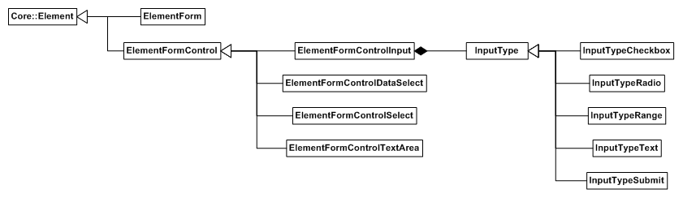

RmlUi 包含一套功能全面的表单控件。这些控件的完整 RML 规范可以在[这里]({{"pages/rml/forms.html"|relative_url}})找到。可用的表单控件有：

* [文本和密码字段](#text-field)
* [文本区域](#text-area)
* [单选按钮和复选框](#radio-button-and-checkbox)
* [下拉选择列表](#drop-down-select-box)
* [范围滑块](#range-slider)

下面是 RmlUi 中包含的自定义表单元素的层级。



### 表单控件接口

所有表单控件元素都派生自 `Rml::ElementFormControl` 接口。每个表单控件都有两个与之关联的值；name 和 value。name 用于标识控件。value 指定控件的当前设置；value 的确切定义取决于控件。当提交一组表单控件时，控件的 name 和 value 成为提交的参数。

可以使用 `Rml::ElementFormControl` 上的 `GetName()` 和 `SetName()` 函数获取和设置表单控件的名称。

```cpp
// Returns the name of the form control.
// @return The name of the form control.
Rml::String GetName() const;

// Sets the name of the form control.
// @param[in] name The new name of the form control.
void SetName(const Rml::String& name);
```

可以使用 `GetValue()` 和 `SetValue()` 函数获取和设置表单控件的值。

```cpp
// Returns a string representation of the current value of the form control.
// @return The value of the form control.
Rml::String GetValue() const;

// Sets the current value of the form control.
// @param[in] value The new value of the form control.
void SetValue(const Rml::String& value);
```

value 的确切语法因控件而异，但 `GetValue()` 始终返回人类可读形式的值。

表单控件也可以动态启用和禁用。所有控件默认启用。

```cpp
// Returns the disabled status of the form control.
// @return True if the element is disabled, false otherwise.
bool IsDisabled() const;

// Sets the disabled status of the form control.
// @param[in] disabled True to disable the element, false to enable.
void SetDisabled(bool disable);
```

#### 通用输入接口

大多数表单控件通过 `<input>`{:.tag} 标签实例化，`type`{:.attr} 标记属性决定它们如何工作。`type`{:.tag} 的可能值有：

* _text_：单行文本字段。这是默认值。
* _password_：与 text 类似，但将所有字符渲染为星号。
* _radio_：单选按钮。
* _checkbox_：复选框按钮。
* _range_：滑块。
* _button_：按钮。
* _submit_：具有按钮式行为、用于提交其父表单的元素。

一个接口用于表示所有这些表单控件，无论其类型如何。它们的类型即使在实例化之后也可以更改。

然而，由于它们没有唯一接口，它们没有像其他表单控件那样的辅助函数来访问其标记属性（attribute）。它们的标记属性必须使用 `GetAttribute()` 和 `SetAttribute()` 访问和修改。

### 文本字段

单行文本字段控件在 RML 中由 `<input type="text" />`{:.tag} 标签指定。密码样式的文本字段可以由 `<input type="password" />`{:.tag} 标签指定。这两个元素的接口都是 `Rml::ElementFormControlInput` 类。

文本字段的大小指的是字段中可见的平均字符数。该值可以通过 `size`{:.attr} 标记属性设置。

文本字段中允许的最大字符数通过 `maxlength`{:.attr} 标记属性设置。

占位符文本可以通过 `placeholder`{:.attr} 标记属性设置。

#### 文本选择
{:#text-selection}

text 和 password 类型的输入元素由 `Rml::ElementFormControlInput` 类表示，该类包含以下文本选择接口。

```cpp
/// Selects all text.
void Select();
/// Selects the text in the given character range.
/// @param[in] selection_start The first character to be selected.
/// @param[in] selection_end The first character *after* the selection.
void SetSelectionRange(int selection_start, int selection_end);
/// Retrieves the selection range and text.
/// @param[out] selection_start The first character selected.
/// @param[out] selection_end The first character *after* the selection.
/// @param[out] selected_text The selected text.
void GetSelection(int* selection_start, int* selection_end, String* selected_text) const;
```

这些方法也可以通过 `Rml::ElementFormControlTextArea` 类用于 `<textarea>`{:.tag} 元素。

#### IME 组合范围

类似地，`Rml::ElementFormControlInput` 和 `Rml::ElementFormControlTextArea` 包含以下 [IME](../ime.html) 组合接口：

```cpp
/// Sets visual feedback used for the IME composition in the range.
/// @param[in] range_start The first character to be selected.
/// @param[in] range_end The first character *after* the selection.
/// @note Only applies to text and password input types.
void SetCompositionRange(int range_start, int range_end);
```

请注意，值的变化会将组合范围重置为零。视觉反馈以实线的形式呈现。

### 文本区域

文本区域，即多行文本字段，在 RML 中用 `<textarea>`{:.tag} 标签指定。文本区域开闭标签之间的任何松散文本将成为控件的初始值。文本区域的接口是 `Rml::ElementFormControlTextArea` 类。

文本区域的固有尺寸由 `cols`{:.attr} 和 `rows`{:.attr} 标记属性控制，它们决定水平和垂直方向可见的字符数。这些值也可以在 C++ 中通过相关方法设置。

```cpp
// Sets the number of characters visible across the text area.
// @param[in] size The number of visible characters.
void SetNumColumns(int num_columns);

// Returns the approximate number of characters visible at once.
// @return The number of visible characters.
int GetNumColumns() const;

// Sets the number of visible lines of text in the text area.
// @param[in] num_rows The new number of visible lines of text.
void SetNumRows(int num_rows);

// Returns the number of visible lines of text in the text area.
// @return The number of visible lines of text.
int GetNumRows() const;
```

与单行文本字段类似，文本区域中的最大字符数可以通过 `maxlength`{:.attr} 标记属性进行限制。在 C++ 中可以使用 `GetMaxLength()` 函数访问，并用 `SetMaxLength()` 函数更改。

```cpp
// Sets the maximum length (in characters) of this text area.
// @param[in] max_length The new maximum length of the text area. A number lower than zero will mean infinite characters.
void SetMaxLength(int max_length);

// Returns the maximum length (in characters) of this text area.
// @return The maximum number of characters allowed in this text area.
int GetMaxLength() const;
```

文本区域的自动换行状态在 RML 中用 `wrap`{:.attr} 标记属性设置。可以在 C++ 中使用 `GetWordWrap()` 和 `SetWordWrap()` 函数更改。

```cpp
// Enables or disables word-wrapping in the text area.
// @param[in] word_wrap True to enable word-wrapping, false to disable.
void SetWordWrap(bool word_wrap);

// Returns the state of word-wrapping in the text area.
// @return True if the text area is word-wrapping, false otherwise.
bool GetWordWrap();
```

占位符文本可以通过 `placeholder`{:.attr} 标记属性设置。

此外，[文本选择接口](#text-selection)中的方法也复制到文本区域接口中。

### 单选按钮和复选框

单选按钮（`<input type="radio" />`{:.tag}）和复选框（`<input type="checkbox" />`{:.tag}）是两种相似的表单控件类型。两者都只在其被选中时提交其值。单选按钮在被选中时会取消选中所有同名的其他单选按钮。两种控件的接口都是 `Rml::ElementFormControlInput`。

复选框或单选按钮的选中状态默认为 false，但可以通过 `checked`{:.attr} 标记属性初始化为 true。要取消选中复选框，请使用 `RemoveAttribute()` 移除 `checked`{:.attr} 标记属性。

### 下拉选择框

简单的下拉选择控件在 RML 中用 `<select>`{:.tag} 标签指定。选择框中的各个选项由子级 `<option>`{:.tag} 元素指定。选择控件的值设置为当前所选选项的 value 标记属性。
以下 RML 片段声明了一个选择框：

```html
<select name="graphics">
	<option value="bad">Bad</option>
	<option value="ok">OK</option>
	<option value="good" selected>good</option>
</select>
```

选择控件的接口是 `Rml::ElementFormControlSelect` 类。选择框中的选项总数可以使用 `GetNumOptions()` 方法查询。

```cpp
// Returns the number of options in the select control.
// @return The number of options.
int GetNumOptions() const;
```

可以使用 `GetOption()` 方法访问各个选项。

```cpp
// Returns one of the select control's option elements.
// @param[in] The index of the desired option.
// @return The option element or nullptr if the index was out of bounds.
Rml::Element* GetOption(int index);
```

`GetOption()` 返回给定索引的 `<option>`{:.tag} 元素的指针。可以通过检索其 `value`{:.attr} 标记属性来获取给定选项的值。

可以使用 `GetSelection()` 函数访问所选选项，并使用 `SetSelection()` 函数设置它。

```cpp
// Sets the index of the selection. If the new index lies outside of the bounds, it will be clamped.
// @param[in] selection The new selection index.
void SetSelection(int selection);

// Returns the index of the currently selected item.
// @return The index of the currently selected item.
int GetSelection() const;
```

可以使用 `Add()`、`Remove()` 和 `RemoveAll()` 函数以编程方式添加和移除选项。

```cpp
// Adds a new option to the select control.
// @param[in] rml The RML content used to represent the option.
// @param[in] value The value of the option.
// @param[in] before The index of the element to insert the new option before. If out of bounds the new option will be
//   added at the end of the list.
// @param[in] selectable If true this option can be selected. If false, this option is not selectable.
// @return The index of the new option.
int Add(const Rml::String& rml,
        const Rml::String& value,
        int before = -1,
        bool selectable = true);

// Removes an option from the select control.
// @param[in] index The index of the option to remove. If this is outside of the bounds of the control's option list, no
//   option will be removed.
void Remove(int index);

// Removes all options from the select control.
void RemoveAll();
```

选择框的可见性可以使用以下函数控制和检索。

```cpp
// Shows the selection box.
void ShowSelectBox();

// Hides the selection box.
void HideSelectBox();

// Revert to the value selected when the selection box was opened, then hide the box.
void CancelSelectBox();

// Check whether the select box is visible or not.
bool IsSelectBoxVisible();
```


#### 应用样式属性（property）

有关将样式属性应用于选择框的文档，请参阅[样式指南](../../style_guide.html#drop-down-selection-boxes)。


### 范围滑块

范围控件可用于渲染基于滑块的数字字段。它在 RML 中用 `<input type='range' />`{:.tag} 标签指定。范围控件的接口是 `Rml::ElementFormControlInput` 类。

范围的最小值和最大值用 `min`{:.attr} 和 `max`{:.attr} 标记属性指定。范围的步长（即值可以增加或减少的增量）用 `step`{:.attr} 标记属性指定。

#### 应用样式属性（property）

有关将样式属性应用于范围控件的文档，请参阅[样式指南](../../style_guide.html#sliders)。


### 表单容器

form 元素被设计为表单控件的容器元素。表单可以被提交，这将所有后代表单控件的 name 和 value 对捆绑到单个事件中。form 元素在 RML 中用 `<form>`{:.tag} 标签指定。它在被提交时将生成一个 `submit`{:.evt} 事件；因此通常为 `onsubmit`{:.attr} 提供一个内联事件处理器。

form 元素的接口是 `Rml::ElementForm` 类。可以通过调用 `Submit()` 函数提交表单。

```cpp
// Submits the form.
// @param[in] submit_value The value to send through as the 'submit' parameter.
void Submit(const Rml::String& submit_value = "");
```

submit_value 参数的值将成为 submit 事件上 submit 参数的值。这样，监听事件的对象可以区分不同类型的提交动作。


### 表单提交按钮

表单提交按钮在 RML 中用 `<input type="submit" />`{:.tag} 标签指定。提交按钮在被点击时将触发其祖先表单上的提交，提交值等于其 `value`{:.attr} 标记属性。其接口是类 `Rml::ElementFormControlInput`。


#### 应用样式属性（property）

有关将样式属性应用于选择框的文档，请参阅[样式指南](../../style_guide.html#drop-down-selection-boxes)。