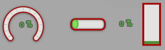

`<progress>`{:.tag} 元素可以显示进度条和仪表盘。条形或仪表盘将根据提供的值填充。

你可以在此处找到 progress 元素的 RML 文档：{{"pages/rml/data_display.html#progress"|relative_url}}。


### 接口

`Rml::ElementProgress` 类（位于 `<RmlUi/Core/Elements/ElementProgress.h>`{:.incl}）定义了 progress 元素的接口。

进度值和最大值可以通过 C++ 接口设置。

```cpp
/// Returns the value of the progress bar.
float GetValue() const;
/// Sets the value of the progress bar.
void SetValue(float value);

/// Returns the maximum value of the progress bar.
float GetMax() const;
/// Sets the maximum value of the progress bar.
void SetMax(float max_value);
```

否则，可以使用 `Element::SetAttribute` 函数设置 value 和其他标记属性（attribute）。


### 样式

`progress`{:.tag} 元素生成一个非 DOM 的 `fill`{:.tag} 子元素，可用于设置条形图已填充部分的样式。`fill`{:.tag} 元素可以使用常规样式属性（property），例如 `background-color`{:.prop}、`border`{:.prop} 和 `decorator`{:.prop} 来设置样式。`fill`{:.tag} 元素将自动定位和调整大小以覆盖父级 `progress`{:.tag} 元素的内容区域，然后根据其 `value` 和 `direction` 标记属性缩小。

或者，使用 `fill-image`{:.prop} 属性设置进度条已填充部分的样式。此属性允许你设置一个图像，该图像将根据进度 `value` 被裁剪。`fill-image`{:.prop} 属性是设置圆形进度条（`clockwise` 和 `counter-clockwise` 方向）样式的唯一方法。`fill`{:.tag} 元素仍然可用，但它的大小将始终固定，与 `value` 标记属性无关。


#### RCSS 属性
{:#fill-image}

`fill-image`{:.prop}

值： | \<string\>
初始值： | *empty*
适用于： | `progress`{:.tag} 元素
继承： | 否
百分比： | 不适用

`fill-image`{:.prop} 属性设置一个图像来表示 progress 元素的已填充部分。它将根据进度条的 `value` 调整大小。此属性是设置圆形进度条（`clockwise` 和 `counter-clockwise` 方向）样式的唯一方法。

值 \<string\> 指的是精灵图名称或图像 URL。


### 示例

以下 RCSS 设置了三个不同进度条的样式。
```css
@spritesheet progress_bars
{
	src: my_progress_bars.tga;
	gauge:             0px 271px 100px 86px;
	gauge-fill:        0px 356px 100px 86px;
	progress:        103px 267px  80px 34px;
	progress-fill-l: 110px 302px   6px 34px;
	progress-fill-c: 140px 302px   6px 34px;
	progress-fill-r: 170px 302px   6px 34px;
}
.gauge { 
	decorator: image( gauge );
	width: 100px;
	height: 86px;
	fill-image: gauge-fill;
}
.horizontal { 
	decorator: image( progress );
	width: 80px;
	height: 34px;
}
.horizontal fill {
	decorator: tiled-horizontal( progress-fill-l, progress-fill-c, progress-fill-r );
	margin: 0 7px;
	/* padding ensures that the decorator has a minimum width when the value is zero */
	padding-left: 14px;
}
.vertical {
	width: 30px;
	height: 80px;
	background-color: #E3E4E1;
	border: 4px #A90909;
}
.vertical fill {
	border: 3px #4D9137;
	background-color: #7AE857;
}
```
现在它们可以在 RML 中如下使用。
```html
<progress class="gauge" direction="clockwise" start-edge="bottom" value="0.3"/>
<progress class="horizontal" value="75" max="100"/>
<progress class="vertical" direction="top" value="0.6"/>
```

结果可以在下面的动画中看到，其中还添加了文本标签。

