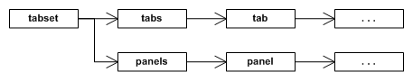

RmlUi 附带一个选项卡集控件，用于将内容拆分为多个选项卡面板。该控件有一个始终可见的选项卡列表，可以点击以显示其关联的面板。任何时刻只有一个面板可见。

你可以在此处找到选项卡集元素的 RML 文档：{{"pages/rml/controls.html#tabset"|relative_url}}。

下面是一个演示选项卡集声明的 RML 示例：

```html
<rml>
<head>
</head>
<body>
	<tabset>
		<tab>Tab 1</tab>
		<panel>
			Welcome to the first tab!
		</panel>
		<tab>Tab 2</tab>
		<panel>
			Welcome to the second tab!
		</panel>
	</tabset>
...
</rml>
```

`Rml::ElementTabSet` 类（位于 `<RmlUi/Core/Elements/ElementTabSet.h>`{:.incl}）定义了选项卡集元素的接口。

`GetNumTabs()` 函数将返回选项卡集内面板的数量。

```cpp
// Retrieve the number of tabs in the tab set.
// @return The number of tabs.
int GetNumTabs();
```

### 设置活动选项卡

以下函数可以更改和获取活动选项卡。

```cpp
// Sets the currently active (visible) tab index.
// @param[in] tab_index Index of the tab to display.
void SetActiveTab(int tab_index);

// Get the current active tab index.
// @return The index of the active tab.
int GetActiveTab() const;
```

当某个选项卡被激活时，只有对应的面板可见。其他面板的 `display`{:.prop} 属性将被设置为 `none`{:.value}。

### 设置选项卡内容

通过 C++，面板选项卡的内容可以设置为未解析的 RML 或现有的元素层级。

```cpp
// Sets the specifed tab index's tab title RML.
// @param[in] tab_index The tab index to set. If it doesn't already exist, it will be created.
// @param[in] rml The RML to set on the tab title.
void SetTab(int tab_index, const Rml::String& rml);

// Set the specifed tab index's title element.
// @param[in] tab_index The tab index to set. If it doesn't already exist, it will be created.
// @param[in] element The root of the element tree to set as the tab title.
void SetTab(int tab_index, Rml::ElementPtr element);
```

当选项卡的内容被设置时，它将替换以前拥有的任何内容。如果你指定一个不存在的选项卡索引，它将被创建。第二个函数接受一个 `ElementPtr`，因此，该函数拥有给定元素的所有权。不能使用原始指针，如果它们位于层级中，必须首先从它们的父元素中移除。

请注意，这些函数只设置选项卡按钮的内容，而不是面板本身。

### 设置面板内容

与面板选项卡类似，面板本身的内容可以设置为未解析的 RML 或现有元素。

```cpp
// Sets the specifed tab index's tab panel RML.
// @param[in] tab_index The tab index to set. If it doesn't already exist, it will be created.
// @param[in] rml The RML to set on the tab panel.
void SetPanel(int tab_index, const Rml::String& rml);

// Set the specified tab index's body element.
// @param[in] tab_index The tab index to set. If it doesn't already exist, it will be created.
// @param[in] element The root of the element tree to set as the window.
void SetPanel(int tab_index, Rml::ElementPtr element);
```

### 移除面板

`RemoveTab()` 函数将从选项卡集中移除现有的选项卡及其面板。

```cpp
// Remove one of the tab set's panels and its corresponding tab.
// @param[in] tab_index The tab index to remove. If no tab matches this index, nothing will be removed.
void RemoveTab(int tab_index);
```

### 应用样式属性（property）

选项卡集及其元素可以像其他元素一样应用样式属性（property），并且为了正确定位，它们将需要这样做。对于水平布局，选项卡的 `display`{:.prop} 属性应设置为 `inline-block`{:.value}。对于面板，在典型的布局场景中，`display`{:.prop} 可以设置为 `block`{:.value}。请注意，当面板不是活动选项卡时，其 `display`{:.prop} 属性将自动在本地元素样式上设置为 `none`{:.value}。随后，当面板被激活时，`display`{:.prop} 属性会从本地元素样式中移除，从而有效地激活 RCSS 文档中设置的属性。因此，请确保 `display`{:.prop} 属性添加到 RCSS 文档中，而不是作为面板元素的内联样式。

下图详细说明了选项卡集的内部层级。



选项卡集元素本身（标签为 tabset）将有两个子元素：panels，它包含所有面板元素；tabs，它包含所有选项卡元素。每个面板和选项卡元素都包含任意的 RML 内容。选项卡集的典型 RCSS 定义如下：

```css
/* Force the tabset element to a fixed size. */
tabset
{
	display: block;
	width: 300px;
	height: 200px;
}

/* Display the tab container as a block element 20 pixels high; it will
   be positioned at the top of the tabset. */
tabset tabs
{
	display: block;
	height: 20px;
}

/* Force each tab to only take up 50 pixels across the tabs element. */
tabset tab
{
	display: inline-block;
	width: 50px;
}

/* Display the panel container as a block element 180 pixels high; it will
   be positioned below the tab container and take up the rest of the space
   in the tabset. */
tabset panels
{
	display: block;
	height: 180px;
}

/* Fix each panel to take up exactly the panelled space. */
tabset panels panel
{
	display: block;
	width: 100%;
	height: 100%;
}
```

panels 和 tabs 元素的顺序由 RML 顺序决定；如果 panel 元素在 tab 元素之前遇到，则先创建 panels 元素，反之亦然。这样，你就可以创建选项卡在底部或顶部的选项卡集。