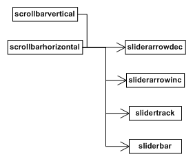

在适当的情况下，RmlUi 会自动为内容溢出的元素生成隐藏的滚动条元素。滚动条元素的大小和定位可以通过 RCSS 属性影响。自定义元素可以利用滚动条功能来生成自己的滚动条。

### 隐藏元素

滚动条元素根据其方向被标记为 `scrollbarvertical`{:.tag} 或 `scrollbarhorizontal`{:.tag}，并直接作为生成它们的元素的子元素。每个滚动条元素包含四个隐藏的子元素：

* `sliderarrowdec`{:.tag}：滚动条顶部（或左侧）的按钮，可以点击以进一步向上（或向左）滚动元素。
* `sliderarrowinc`{:.tag}：滚动条底部（或右侧）的按钮，可以点击以进一步向下（或向右）滚动元素。
* `slidertrack`{:.tag}：在两个箭头按钮之间运行的轨道。
* `sliderbar`{:.tag}：在轨道上运行的滑块。它表示元素内容的可见段的大小和位置。它可以被拖动以四处滚动可见窗口。



当元素上同时存在水平和垂直滚动条时，它们都会被缩短所需量以避免交叉。另一个元素会被创建并放置在这个交叉点，适当地放置和调整大小。这个角落元素被标记为 scrollbarcorner，仅用于装饰目的。

#### 应用 RCSS 属性

请参阅[样式指南](../style_guide.html)了解如何向滚动条应用属性的文档。

### 生成滚动条

自定义元素可以使用元素的滚动接口生成滚动条。例如，[文本区域](element_packages/form.html#text-area)表单控件就是这样做的。

滚动条生成通常在自定义元素中响应布局期间发送的 `resize`{:.evt} 事件完成。要检索指向元素的滚动接口的指针，请在元素上调用 `GetElementScroll()`。这将返回一个 `Rml::ElementScroll` 对象。

```cpp
// Returns the element's scrollbar functionality.
// @return The element's scrolling functionality.
Rml::ElementScroll* GetElementScroll() const;
```

要启用或禁用元素的一个滚动条，请调用 `EnableScrollbar()` 或 `DisableScrollbar()`：

```cpp
// Enables and sizes one of the scrollbars.
// @param[in] orientation Which scrollbar (vertical or horizontal) to enable.
// @param[in] element_width The current computed width of the element, used only to resolve percentage properties.
void EnableScrollbar(Rml::ElementScroll::Orientation orientation, float element_width);

// Disables and hides one of the scrollbars.
// @param[in] orientation Which scrollbar (vertical or horizontal) to disable.
void DisableScrollbar(Rml::ElementScroll::Orientation orientation);
```

由于该对象会记住两个先前滚动条的状态，建议你显式启用或禁用两个滚动条。

一旦你设置了两个滚动条的状态并设置了滚动元素的大小（和内容大小），请调用 `FormatScrollbars()`。

```cpp
// Formats the enabled scrollbars based on the current size of the host element.
void FormatScrollbars();
```