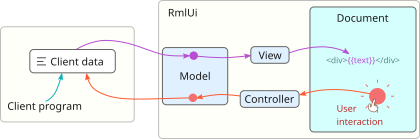


The open and close brackets { { ... } } used in RmlUi's data binding syntax interferes with the Liquid templating language in Jekyll. We turn off Liquid processing by enabling raw mode for the entire document.




RmlUi 通过数据绑定实现了模型-视图-控制器（model-view-controller，MVC）架构。这是一种强大的方式，可以响应数据的变化，或者反向地根据用户操作更新数据。

在 RmlUi 采用的方法中，MVC 各术语的含义如下。

- `Model`（模型） 数据模型是通过数据变量在用户数据与分配给该模型的视图和控制器之间的接口。
- `View`（视图） 数据视图用于以不同方式在文档中呈现数据变量。
- `Controller`（控制器） 数据控制器通常通过为数据变量设置新值来响应用户输入。

一旦变量变为脏（dirty）状态，视图就会自动更新。这确保了显示给用户的文档始终与应用程序数据保持同步。使用 MVC 方法时，无需逐个处理元素，也无需手动修改 RML。

请参阅以下详细章节：

- [示例](data_bindings/examples.html)
- [数据变量与表达式](data_bindings/expressions.html)
- [数据模型](data_bindings/model.html)
- [数据视图与控制器](data_bindings/views_and_controllers.html)

---

---

##### 限制

- 不应在数据模型内部影响文档结构。这包括手动添加或删除元素。例如，在 `data-for` 视图内部删除元素属于未定义行为，可能导致崩溃。
- 目前，只有顶层数据变量可以具有脏（dirty）状态。这意味着数据地址不能仅用于将某个数组索引或结构体成员标记为脏。不过，未发生变化的子值会在相关视图内部被忽略。
- 在元素已附加到文档之后添加 `data-` 属性不会产生任何效果。
- 不支持注册 `const` 对象或成员函数，也不支持注册从父类继承的成员。
- 如果在不同的动态库中绑定变量，可能需要重新注册类型。

##### 元素兼容性

- 某些特殊元素会在内部改变文档结构。对于此类元素，数据绑定可能无法按预期工作。其中尤其包括 `<tabset>`{:.tag}、`<panel>`{:.tag} 和 `<tab>`{:.tag} 元素，特别是在与 `data-for` 视图结合使用时。
- `<select>`{:.tag} 元素可能并不总能正确反映其 `<option>`{:.tag} 的底层 `selected`{:.attr} 或 `value`{:.attr} 属性以及选项内容的变化。要动态更改选中的选项，请在 `<select>`{:.tag} 元素上使用 `data-value` 视图。请注意，使用 `data-for` 初始填充选项现在应当可以正常工作。

##### 编写说明

- 在 RmlUi 中，以 `data-` 开头的元素属性保留用于数据绑定。
- 在 RML 文档中，所有使用 `{{` 和 `}}` 的地方都保留用于数据绑定。



 End raw mode, see the comment at the beginning of the document. 