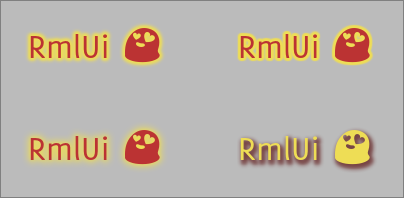

发光字体效果在文本周围渲染模糊的描边。



描边过程与随后的模糊过程都可以独立控制。此外，还可以应用偏移，这使得该效果也适合生成投影。

效果声明如下：

```css
font-effect: glow( <width-outline> <width-blur> <offset-x> <offset-y> <color> );
```


其属性由以下内容指定。

`width-outline`{:.prop}

取值： | \<length\>
初始值： | 1px
百分比： | 不适用

决定效果的描边宽度。

`width-blur`{:.prop}

取值： | \<length\>
初始值： | -1px
百分比： | 不适用

决定效果的模糊宽度。若指定值为负，则使用值将从 `width-outline`{:.prop} 复制。

`offset-x`{:.prop}

取值： | \<length\>
初始值： | 0px
百分比： | 不适用

`offset-y`{:.prop}

取值： | \<length\>
初始值： | 0px
百分比： | 不适用

这些属性定义源文本与发光效果之间的偏移（以像素为单位）。


`color`{:.prop}

取值： | \<color\>
初始值： | white
百分比： | 不适用

该颜色以乘法方式应用于整个效果。


```css
/* Declares a glow font effect. */
h1
{
	font-effect: glow( 3px #ee9 );
}
/* The glow effect can also create nice looking shadows. */
p.glow_shadow
{
	color: #ed5;
	font-effect: glow(2px 4px 2px 3px #644);
}
```