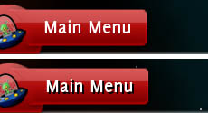

阴影字体效果渲染带有偏移的彩色文本副本，从而产生阴影效果。



效果声明如下：

```css
font-effect: shadow( <offset-x> <offset-y> <color> );
```

其属性由以下内容指定。

`offset-x`{:.prop}

取值： | \<length\>
初始值： | 0px
百分比： | 不适用

`offset-y`{:.prop}

取值： | \<length\>
初始值： | 0px
百分比： | 不适用

这些属性定义源文本与阴影之间的偏移（以像素为单位）。


`color`{:.prop}

取值： | \<color\>
初始值： | white
百分比： | 不适用

该颜色以乘法方式应用于整个效果。


```css
/* Declares a shadow font effect. */
h1
{
	font-effect: shadow( 2px 2px black );
}
```