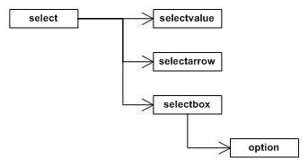

RmlUi 不提供任何内置样式。相反，它将设置样式的全部权力和责任交给用户。这带来了很大的灵活性，但也要求用户为所有元素设置样式，包括 `<input>`{:.tag} 和 `<select>`{:.tag} 等内置元素，以及滚动条等生成元素。建议引入 [HTML 样式表](rml/html4_style_sheet.html)，以便常见标签名称能够像在 HTML 中一样进行布局。

RmlUi 中的元素（包括内置元素）可以使用普通的 RCSS 属性设置样式。此外，RmlUi 提供若干功能性元素，它们会生成额外的*隐藏*元素，这些隐藏元素本身也可以设置样式。本文将介绍其中的一些元素，如滚动条、滑块和下拉选择框，并就如何为它们设置样式给出建议。

### 滚动条

任何具有滚动溢出的元素（在 `overflow-x`{:.prop} 或 `overflow-y`{:.prop} 属性上取值为 `scroll`{:.value} 或 `auto`{:.value}）都可能在其底部或右侧生成滚动条。默认情况下，这些是简单的块级元素，没有背景颜色或装饰器。

#### 生成的元素

滚动条元素根据方向被标记为 `scrollbarhorizontal`{:.tag} 或 `scrollbarvertical`{:.tag}。它们是直接归属于滚动元素的隐藏元素。每个滚动条元素包含四个子元素：

* `sliderarrowdec`{:.tag}：位于滚动条顶部（或左侧）的按钮，可以点击以继续向上（或向左）滚动元素。
* `sliderarrowinc`{:.tag}：位于滚动条底部（或右侧）的按钮，可以点击以继续向下（或向右）滚动元素。
* `slidertrack`{:.tag}：位于两个箭头按钮之间的轨道。
* `sliderbar`{:.tag}：在轨道上运行的滑块。它表示元素内容可见段的大小和位置。可以拖拽它来滚动可见区域。


当一个元素同时具有水平和垂直滚动条时，它们都会缩短必要的量以避免交叉。另一个元素会被创建并放置在这个交叉点上，并适当调整其位置和大小。这个角落元素被标记为 scrollbarcorner，仅用于装饰目的。

#### 应用 RCSS 属性

所有这些元素都可以通过 RCSS 设置样式，以适当地调整大小、位置和渲染效果。下面给出了配置滚动条的推荐方法（注意：这是针对垂直滚动条的；对于水平滚动条，请交换宽度和高度）：

1. 将 `scrollbarvertical`{:.tag} 元素的 `width`{:.prop} 属性设置为适合你的界面设计的值。该宽度应足以容纳箭头、轨道和滑块。
2. 适当地设置 `sliderarrowdec`{:.tag} 和 `sliderarrowinc`{:.tag} 元素的 `width`{:.prop} 和 `height`{:.prop} 属性。如果你不需要按钮，请将它们设置为 `0`{:.value}。
3. 适当地设置 `slidertrack`{:.tag} 的 `width`{:.prop} 属性。轨道的 `height`{:.prop} 值将被忽略，并且总是由内部设置。使用 `margin-left`{:.prop} 在滚动条内定位轨道。
4. 适当地设置 `sliderbar`{:.tag} 的 `width`{:.prop} 属性。滑块的高度会在内部生成，但你可以使用 `height`{:.prop} 属性覆盖它，或使用 `min-height`{:.prop} 和 `max-height`{:.prop} 属性来影响它。
5. 适当地为各元素应用装饰器。

更多提示请参阅 _Rocket Invaders from Mars_ 演示样式表和[模板教程](tutorials/window_template.html)。

#### 'scrollbar-margin' 属性

{:#scrollbar-margin}

`scrollbar-margin`{:.prop}

值： | \<length\>
初始值： | 0px
适用于： | 滚动容器
继承： | 否
百分比： | 不适用

如上所述，滚动条元素（`scrollbarvertical`{:.tag} 和 `scrollbarhorizontal`{:.tag}）会自动缩短自身以避免角落交叉。这可能导致滚动条反复出现和消失（例如在窗口调整大小期间），并导致另一个滚动条快速改变大小。为了避免这种情况，并强制滚动条始终为角落缩短自身，你可以对滚动条元素使用数值 `scrollbar-margin`{:.prop} 属性。元素将按相应角落尺寸与 scrollbar margin 中的较小值来缩短自身（在底部或右侧，视情况而定）。

#### RCSS 示例

以下是 _Rocket Invaders from Mars_ 样式表中与滚动条相关的部分。

```css
@spritesheet theme
{
	src: invader.tga;

	/* ... */

	slidertrack-t: 70px 199px 27px 2px;
	slidertrack-c: 70px 201px 27px 1px;
	slidertrack-b: 70px 202px 27px 2px;

	sliderbar-t:         56px 152px 23px 23px;
	sliderbar-c:         56px 175px 23px 1px;
	sliderbar-b:         56px 176px 23px 22px;
	sliderbar-hover-t:   80px 152px 23px 23px;
	sliderbar-hover-c:   80px 175px 23px 1px;
	sliderbar-hover-b:   80px 176px 23px 22px;
	sliderbar-active-t: 104px 152px 23px 23px;
	sliderbar-active-c: 104px 175px 23px 1px;
	sliderbar-active-b: 104px 176px 23px 22px;

	sliderarrowdec: 0px 152px 27px 24px;
	sliderarrowdec-hover: 0px 177px 27px 24px;
	sliderarrowdec-active: 0px 202px 27px 24px;

	sliderarrowinc: 28px 152px 27px 24px;
	sliderarrowinc-hover: 28px 177px 27px 24px;
	sliderarrowinc-active: 28px 202px 27px 24px;
}

/* Fix the width and push the scrollbar back to the extents of the window. */
scrollbarvertical
{
	margin-top: -6px;
	margin-bottom: -6px;
	margin-right: -11px;
	width: 27px;
}

/* Decorate the slider track. */
scrollbarvertical slidertrack
{
	decorator: tiled-vertical( slidertrack-t, slidertrack-c, slidertrack-b );
}
/* Darken the decorator on active. */
scrollbarvertical slidertrack:active
{
	image-color: #aaa;
}

/* Push the slider bar in 4 pixels from the left edge. Fix the width of the bar and make sure
   the height doesn't drop below 46 pixels; under that the decorator will start squishing the
   images. */
scrollbarvertical sliderbar
{
	margin-left: 4px;
	width: 23px;
	min-height: 46px;

	decorator: tiled-vertical( sliderbar-t, sliderbar-c, sliderbar-b );
}

/* Animate the bar's decorator on hover. */
scrollbarvertical sliderbar:hover
{
	decorator: tiled-vertical( sliderbar-hover-t, sliderbar-hover-c, sliderbar-hover-b );
}

/* Animate the bar's decorator on active. */
scrollbarvertical sliderbar:active
{
	decorator: tiled-vertical( sliderbar-active-t, sliderbar-active-c, sliderbar-active-b );
}

/* Fix the size of the 'page up' slider arrow and decorate it appropriately. */
scrollbarvertical sliderarrowdec
{
	width: 27px;
	height: 24px;

	decorator: image( sliderarrowdec );
}
/* Animate the arrows on hover. */
scrollbarvertical sliderarrowdec:hover
{
	decorator: image( sliderarrowdec-hover );
}
/* Animate the arrows on active. */
scrollbarvertical sliderarrowdec:active
{
	decorator: image( sliderarrowdec-active );
}


/* Fix the size of the 'page down' slider arrow and decorate it appropriately. */
scrollbarvertical sliderarrowinc
{
	width: 27px;
	height: 24px;

	decorator: image( sliderarrowinc )
}
/* Animate the arrows on hover. */
scrollbarvertical sliderarrowinc:hover
{
	decorator: image( sliderarrowinc-hover );
}
/* Animate the arrows on active. */
scrollbarvertical sliderarrowinc:active
{
	decorator: image( sliderarrowinc-active );
}
```

### 滑块

范围滑块可以通过 RML 标签 `<input type="range" ... />`{:.tag} 实例化。在内部，它们与滚动条共享大部分相同的子元素，具体来说：

* `sliderarrowdec`{:.tag}
* `sliderarrowinc`{:.tag}
* `slidertrack`{:.tag}
* `sliderbar`{:.tag}

它们的样式设置方式与滚动条相同。此外，范围滑块还有以下特性：

* `sliderprogress`{:.tag}。`slidertrack`{:.tag} 的一个子元素，会自动调整大小以指示滑块已经经过了轨道的多少部分。

请注意，对于输入类型，`<input>`{:.tag} 元素的 `type`{:.attr} 属性会自动设置为一个类，以便在样式表中指定。因此，以下规则会将属性应用于输入的滑块轨道：

```css
input.range slidertrack
{
	/* ... */
}
```

### 下拉选择框

下拉选择框可以通过 RML 标签 `<select>`{:.tag} 实例化，其中的各个选项在 selection 元素内使用 `<option>`{:.tag} 标签指定。

#### 固有尺寸

RmlUi 中的下拉选择框具有固定的固有尺寸，而不是像 Web 浏览器中的常见行为那样适应其内容的大小。相反，应显式指定 `width`{:.prop} 和 `height`{:.prop} 属性来达到所需的大小。

#### 生成的元素

select 元素会生成三个隐藏元素：

* `selectvalue`{:.tag}：所选选项的容器元素。
* `selectarrow`{:.tag}：渲染在 value 元素右侧的按钮。
* `selectbox`{:.tag}：包含选项的框。当点击箭头或 value 元素、或选中某个选项时，该元素的可见性会被切换。

当选择框可见时，select 元素上会设置伪类 `:checked`{:.cls}。此外，其下拉列表中选中的选项也会设置 `:checked`{:.cls} 伪类。



#### RCSS 示例

以下是 _Rocket Invaders from Mars_ 样式表中 select 元素的 RCSS 规则和属性：

```css
@spritesheet theme
{
	src: invader.tga;

	/* ... */

	selectbox-tl: 281px 275px 11px 9px;
	selectbox-t:  292px 275px 1px 9px;
	selectbox-tr: 294px 275px 11px 9px;
	selectbox-l:  281px 283px 11px 1px;
	selectbox-c:  292px 283px 1px 1px;
	selectbox-bl: 281px 285px 11px 11px;
	selectbox-b:  292px 285px 1px 11px;
	selectbox-br: 294px 285px 11px 11px;

	selectvalue: 162px 192px 145px 37px;
	selectvalue-hover: 162px 230px 145px 37px;
	selectarrow: 307px 192px 30px 37px;
	selectarrow-hover: 307px 230px 30px 37px;
	selectarrow-active: 307px 268px 30px 37px;

	/* ... */
}

/* Specify the dimensions of the select element. */
select
{
	width: 175px;
	height: 37px;
}

/* Specify the dimensions of the value element within the select element. Padding is used to position the
   value correctly internally. */
select selectvalue
{
	width: auto;
	margin-right: 30px;

	height: 28px;
	padding: 9px 10px 0px 10px;

	decorator: image( selectvalue  );
}

/* Animate the value field when it is hovered. */
select selectvalue:hover
{
	decorator: image( selectvalue-hover );
}

/* Fix the size of the select arrow decorate the element. */
select selectarrow
{
	width: 30px;
	height: 37px;

	decorator: image( selectarrow );
}

/* Animate the arrow when hovered. */
select selectarrow:hover
{
	decorator: image( selectarrow-hover );
}

/* Animate the arrow when the button is pressed or the box is visible. */
select selectarrow:active,
select selectarrow:checked,
{
	decorator: image( selectarrow-active );
}

/* Fix the width of the select box and fiddle with the margins to get it in exactly the right place. */
select selectbox
{
	margin-left: 1px;
	margin-top: -7px;
	width: 162px;
	padding: 1px 4px 4px 4px;

	decorator: tiled-box(
		selectbox-tl, selectbox-t, selectbox-tr,
		selectbox-l, selectbox-c, auto,  /* auto mirrors left */
		selectbox-bl, selectbox-b, selectbox-br
	);
}

/* Sizes the option element to take up the available width in the select box. */
select selectbox option
{
	width: auto;
	padding-left: 3px;
}

/* Specifies every second option in the selection box to have a white background. */
select selectbox option:nth-child(even)
{
	background: #FFFFFFA0;
}

/* Gives the red highlight to the selection box. */
select selectbox option:hover
{
	background: #FF5D5D;
}
```