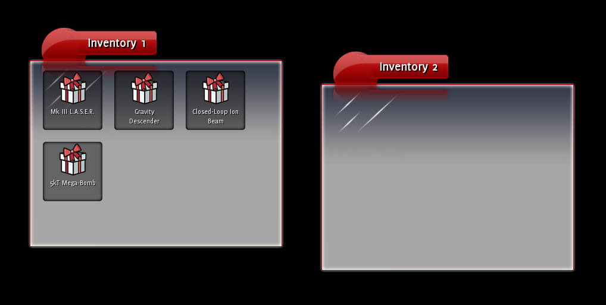
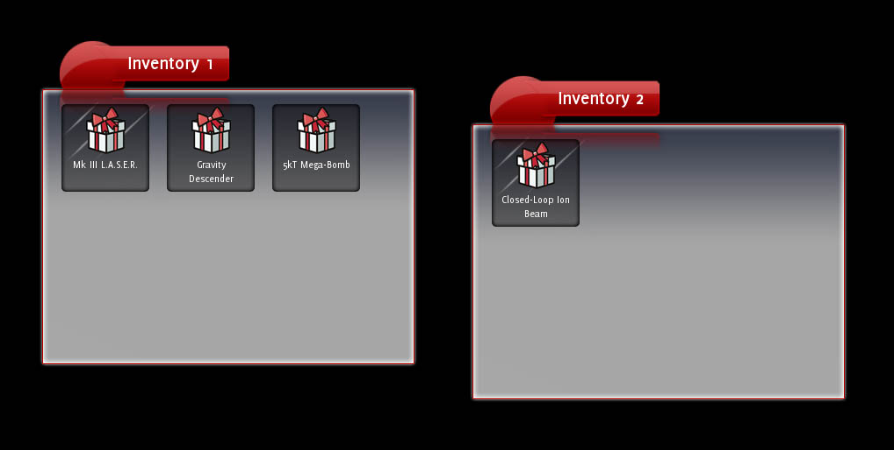

RmlUi 有几种实现元素拖拽的方式，例如：

* `<handle>`{:.tag} 标签，示例应用程序中的文档即采用这种方式
* 将元素的 `drag`{:.prop} 属性设置为 `drag`{:.value} 或 `drag-drop`{:.value}，监听原始拖拽事件（`dragstart`{:.evt}、`dragend`{:.evt} 等），并手动为元素位置制作动画
* 将元素的 `drag`{:.prop} 属性设置为 `clone`{:.value}

本教程演示如何使用第三种方式（克隆）在多个背包窗口之间拖拽物品。

### 第 1 步：初步查看

编译拖拽教程（位于 `/Samples/tutorial/tutorial_drag/`{:.path}）并运行程序；最终界面应如下所示：



查看一下源代码。可以看到，应用程序创建了两个 Inventory 对象，每个对象都从 `inventory.rml`{:.path} 文件中加载文档。应用程序随后在其中一个背包中创建了四个背包对象；这些对象每个都是标签为 `icon`{:.tag} 的 RmlUi 元素。在 `tutorial.rcss`{:.path} 文件的底部，可以看到应用于 `icon`{:.tag} 的属性。其大小为 100px x 100px，带有外边距以与相邻图标分隔，并使用装饰器绘制其背景图像。它向左浮动，因此图标会在背包窗口中从左到右排列。

### 第 2 步：添加拖拽属性

如果你现在尝试拖拽图标，不会有什么反应。在教程的 RCSS 文件中添加以下一行：

```
	drag: clone;
```

把它添加到 `icon`{:.tag} 元素的规则中。现在再次尝试拖拽图标；成功了！拖拽时，图标的克隆体会跟随光标移动。我们需要添加代码来监听拖拽的结束并作出相应响应，但在那之前，我先解释一下 `drag`{:.prop} 属性的工作原理。

`drag`{:.prop} 属性可以根据你希望 RmlUi 如何通知拖拽信息而取若干不同的值。可能的值如下：

* `none`{:.value}：元素不发送任何拖拽消息。这是默认值。
* `block`{:.value}：元素不发送任何拖拽消息，同时也会阻止该元素“下方”的任何元素被拖拽。例如，这对于窗口标题栏上的按钮很有用。
* `drag`{:.value}：如果在元素上按住鼠标左键并拖拽，元素将触发 `dragstart`{:.evt} 事件。此后每次鼠标移动，元素都会触发 `drag`{:.evt} 事件。松开按钮时，元素将触发 `dragend`{:.evt} 事件。
* `drag-drop`{:.value}：与 drag 相同，但当鼠标移动到其他元素上方时，将触发 `dragover`{:.evt} 和 `dragout`{:.evt} 事件（类似于 `mouseover`{:.evt} 和 `mouseout`{:.evt} 事件）。松开按钮时，鼠标悬停的元素将触发 `dragdrop`{:.evt} 消息。
* `clone`{:.value}：与 `drag-drop`{:.value} 相同，但拖拽期间元素的克隆体会附着在鼠标光标上。克隆体上设置了伪类 `drag`{:.cls}，以便与原始元素区分开来。

因此，`drag`{:.value} 和 `drag-drop`{:.value} 都只发送消息；它们不会自动拖拽任何元素。这对于复杂的拖拽操作或拖拽多个元素非常有用。

而 clone 值几乎可以处理所有事情，前提是你只需要拖拽单个元素。

### 第 3 步：监听事件

既然物品可以被直观地拖动了，我们需要在它们被放下时真正改变其父级。创建一个继承自 `Rml::EventListener` 的类，并为其提供一个用于注册容器的静态方法。同时重写 `ProcessEvent()` 函数，以便处理 `dragdrop`{:.evt} 事件。

```cpp
#ifndef DRAGLISTENER_H
#define DRAGLISTENER_H

#include <RmlUi/Core/EventListener.h>
#include <RmlUi/Core/Types.h>

class DragListener : public Rml::EventListener
{
public:
	/// Registers an elemenet as being a container of draggable elements.
	static void RegisterDraggableContainer(Rml::Element* element);

protected:
	virtual void ProcessEvent(Rml::Event& event);
};

#endif
```

`RegisterDraggableContainer()` 函数只需将监听器对象附加到 `dragdrop` 事件上：

```cpp
#include "DragListener.h"
#include <RmlUi/Core/Element.h>

static DragListener drag_listener;

// Registers an element as being a container of draggable elements.
void DragListener::RegisterDraggableContainer(Rml::Element* element)
{
	element->AddEventListener("dragdrop", &drag_listener);
}
```

现在，每当有物品被放到已注册的元素或其任何子元素上时，`DragListener` 对象都会收到对 `ProcessEvent()` 的调用。

#### 'dragdrop' 事件

我们将处理的事件是 `dragdrop`{:.evt} 事件。该事件会发送给被拖拽元素所放到的元素。被拖拽的元素本身可以通过参数 `drag_element`{:.prop} 从事件中查询。

现在我们可以编写一个简单的处理程序，在两个容器之间移动被拖拽的元素：

```cpp
void DragListener::ProcessEvent(Rml::Event& event)
{
	if (event == "dragdrop")
	{
		Rml::Element* dest_container = event.GetCurrentElement();
		Rml::Element* drag_element = static_cast< Rml::Element* >(event.GetParameter< void* >("drag_element", NULL));

		drag_element->GetParentNode()->RemoveChild(drag_element);
		dest_container->AppendChild(drag_element);
	}
}
```

被拖拽的元素只是从其旧父级中移除，并附加到它被放到的容器上。

#### 注册容器

在尝试拖拽之前，剩下要做的就是注册容器。在 Inventory 对象的构造函数中（Inventory.cpp 顶部），我们需要将背包窗口注册为可拖拽容器；在构造函数末尾添加以下一行：

```cpp
	DragListener::RegisterDraggableContainer(document->GetElementById("content"));
```

运行程序，开始拖拽，看看会发生什么。



成功！

### 第 4 步：排序

目前，无论你把物品拖到哪里，它最终都会成为窗口中的最后一个物品。如果可以通过将一个物品拖到另一个物品上来对窗口内的物品进行排序，那就太好了。为此，`ProcessEvent()` 函数需要同时确定元素被拖到的容器以及该容器内的物品。

很简单！我们已经将 `dragdrop`{:.evt} 监听器附加到物品容器上。这意味着，每当 `dragdrop`{:.evt} 事件被发送到容器或其任何子元素（即其中的物品）时，我们都会收到通知。每个事件都有一个目标元素（target element）和一个当前元素（current element）。目标元素是事件实际针对的元素；对于 `dragdrop`{:.evt} 而言，就是被放到的元素。当前元素是正在处理事件的监听器所观察的元素；在我们的例子中，就是容器。

因此，我们可以通过以下方式找到目标物品和容器：

```cpp
void DragListener::ProcessEvent(Rml::Event& event)
{
	if (event == "dragdrop")
	{
		Rml::Element* dest_container = event.GetCurrentElement();
		Rml::Element* dest_element = event.GetTargetElement();
		Rml::Element* drag_element = static_cast< Rml::Element* >(event.GetParameter< void* >("drag_element", NULL));
```

如果被拖拽的物品被直接放到容器上，那么当前元素和目标元素将是同一个。在这种情况下，我们希望保留原有的处理逻辑：

```cpp
		if (dest_container == dest_element)
		{
			// The dragged element was dragged directly onto a container.
			drag_element->GetParentNode()->RemoveChild(drag_element);
			dest_container->AppendChild(drag_element);
		}
```

否则，我们希望将物品插入到其新容器中，位于它被拖到的物品之前。

```cpp
		else
		{
			// The dragged element was dragged onto an item inside a container. In order to get the
			// element in the right place, it will be inserted into the container before the item
			// it was dragged on top of.
			Rml::Element* insert_before = dest_element;

			drag_element->GetParentNode()->RemoveChild(drag_element);
			dest_container->InsertBefore(drag_element, insert_before);
		}
```

再次运行应用程序并尝试一下。一切正常，但可以尝试在同一个窗口内将一个物品拖到另一个物品上；在这种情况下，它应该被插入到被拖到的元素之后，而不是之前。所以，只需在事件处理器中修正这一点，就大功告成了！

你可以在 drag 示例中找到完整实现后的源代码。