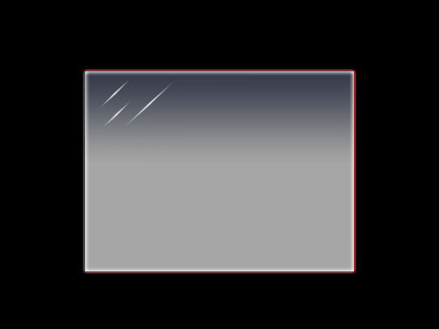
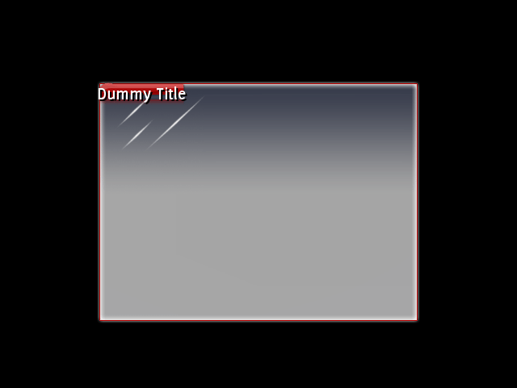
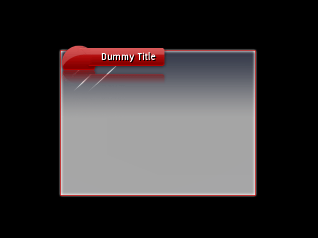
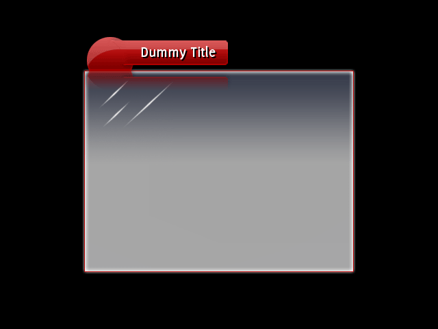
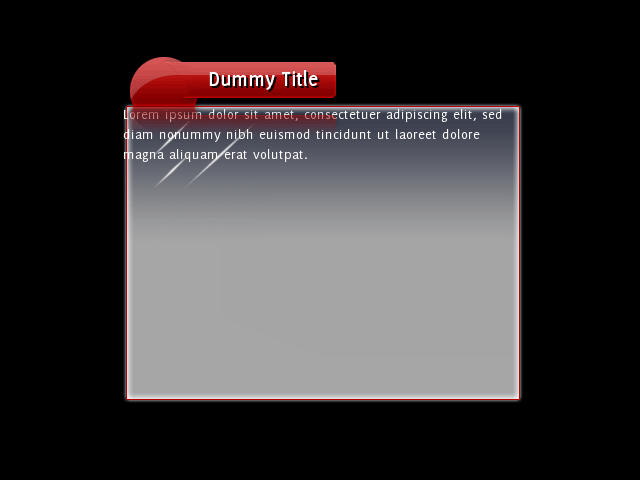
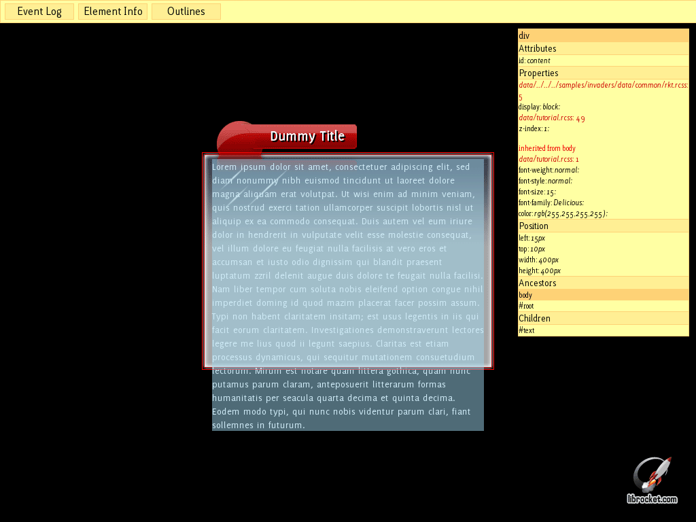
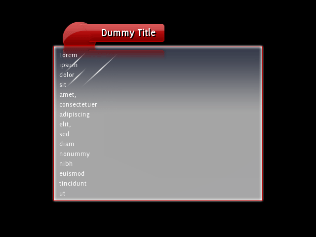
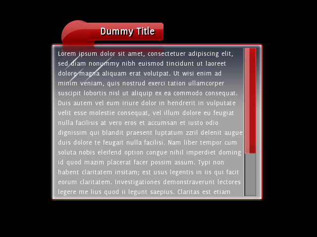
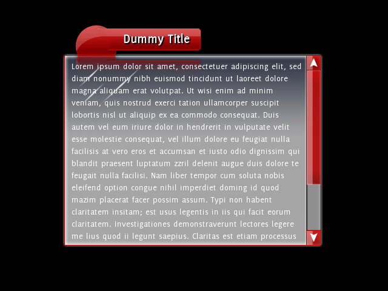

本教程将逐步带你完成我们为 _Rocket Invaders from Mars_ 所使用的窗口模板的 RML 和 RCSS 开发。学完本教程后，你将能够为你的应用程序创建复杂而灵活的模板。

要完成本教程，你需要了解 [RML](../rml.html) 和 [RCSS](../rcss.html)。

### 第 1 步：初步查看

编译模板教程（位于 `/Samples/tutorials/template/`{:.path}）并运行程序；最终你应看到以下画面：



这个程序所做的只是加载并显示 `data/tutorial.rml`{:.path} 中定义的文档。RML 文件本身引用了 `data/tutorial.rcss`{:.path} 和 `/Samples/assets/invader.tga`{:.path}。我们只需要关注 RML 文件和 RCSS 文件；打开这两个文件看一看。

我们在 RML 中最初拥有的只是一个没有子元素的简单文档。它有一个 'window' 类，正如你在 RCSS 中会看到的，正是这个类为它提供了玻璃质感的背景装饰器。文档头部标签中声明的样式为文档指定了固定的宽度和高度（因此它有一定的尺寸），并赋予其自动外边距以在上下文中居中。至于 RCSS，我们只有字体规范和用于绘制背景的平铺盒（tiled-box）装饰器。就是这样！虽然简单，但作为窗口模板还不是很有用。

### 第 2 步：添加标题栏

我们首先来看如何添加标题栏。为此我们需要：

* 位于窗口左上角的元素
* 元素上的水平平铺装饰器，用于渲染标题栏
* 一种在元素上设置文本的方法，以便我们能够以编程方式更改标题
* 元素上的手柄（handle），以便我们能够拖拽窗口

#### 定义标题元素

在 body 中添加一个 `<div>`{:.tag} 元素，并为其指定 ID `title-bar`{:.value}。`<div>`{:.tag} 是块级元素（如基础样式表所定义），因此默认情况下它会水平伸展，占据其父元素（窗口）的整个长度。我们可以把装饰器直接放在这个元素上，但那样它会和窗口一样长；我们只希望它与标题文本一样长。所以，在 `<div>`{:.tag} 元素内部添加一个 `<span>`{:.tag} 元素，并为其指定 ID `title`{:.value}。在 span 中添加一个虚拟标题字符串，这样我们就能轻松地在上面显示一些文本。到目前为止，你应该得到这样的结构：

```html
<body class="window">
	<div id="title-bar">
		<span id="title">Dummy Title</span>
	</div>
</body>
```

运行应用程序；目前还看不出什么效果，但我们会逐步实现！

标题文本目前与正文文本一起渲染；我们需要更大更粗的字体。在 RCSS 文件中，为标题 span 添加一条新规则，为其指定 22 的字号（font-size）和加粗（bold）的字重。既然要做，为什么不顺便添加一个黑色文本阴影呢？规则应该大致如下：

```css
div#title-bar span
{
	font-size: 22px;
	font-weight: bold;

	font-effect: shadow(2px 2px black);
}
```

看起来好一些了，但还没有装饰器。

#### 设置精灵图表

如果你打开 `/Samples/assets/invader.tga`{:.path} 文件，你会看到它包含标题栏等内容的精灵图。现在我们定义本教程中装饰器所用的精灵图表。首先，在文件顶部找到 `theme`{:.value} 精灵图表。窗口的精灵图已经声明过了，但需要添加标题栏的精灵图。

```css
@spritesheet theme
{
	src: ../../../assets/invader.tga;

	/* ... */

	title-bar-l: 147px 0px 82px 85px;
	title-bar-c: 229px 0px  1px 85px;
	title-bar-r: 231px 0px 15px 85px;
}

```
每个精灵图都由名称和矩形定义。矩形按 `x y width height`{:.prop} 的顺序指定，且必须使用像素单位。你可以打开你喜欢的图像编辑器或查看器来找到合适的坐标。


#### 设置装饰器

借助装饰器，我们可以让任何元素看起来都很漂亮。我们先使用刚刚声明的精灵图来定义标题元素的装饰器。所以，在你之前添加的同一条规则中声明装饰器：

```css
div#title-bar span
{
	/* ... */

	decorator: tiled-horizontal( title-bar-l, title-bar-c, title-bar-r );
}
```

这个装饰器会让中间的精灵图拉伸，而两侧保持固定。因此，当文本内容变化时，标题栏可以轻松地进行水平缩放。

再次运行应用程序，看看效果。



嗯，看起来相当糟糕！因为 `<span>`{:.tag} 元素是内联元素，其高度由其内容的高度决定；在本例中，就是虚拟标题文本。装饰器会压缩自身以适应元素。我们也不能在那里添加 height RCSS 属性，因为内联元素（除少数情况外）不能直接设置高度。那我们该怎么办？内边距！外边距、内边距和边框都可以设置在内联元素上，虽然它们不影响元素的垂直定位，但确实会影响元素的大小并影响子元素的位置。所以我们可以使用内边距将元素设置为合适的大小，并让文本正好位于标题栏的中间。

首先在 span 的顶部添加一些内边距：

```css
	padding-top: 50px;
```

看看结果。元素现在大了 50 像素，标题栏看起来好了一些，文本被推到了元素的底部。那么我们需要把标题栏做成多大呢？看一下装饰器声明，你会发现标题栏图像高 85 像素。因此理想情况下，元素也应该是 85 像素高。所以我们需要添加内边距使其达到这个高度——但它现在有多高呢？

要找出答案，你可以使用调试器；按 F8 打开调试菜单。点击 'Element Info' 按钮，然后点击标题栏元素。信息面板会改变，显示关于该元素的大量信息，包括其上定义的属性及其来源、尺寸、子元素和祖先元素。你可以在 'Position' 标题下看到元素的高度；算下来是 80px。所以，我们还需要再添加 5px 的垂直内边距。

将内边距设置为 55px 并查看效果；元素现在应该是 85px 高。接下来将部分内边距移到底部，并调整使文本居中。我发现以下组合能让文本看起来位置合适：

```css
	padding-top: 13px;
	padding-bottom: 42px;
```

文本左右的空间还不多；这很容易解决，只需添加左右内边距！我们在 _Rocket Invaders from Mars_ 中使用了以下值：

```css
	padding-left: 85px;
	padding-right: 25px;
```

但可以自己调整，看看哪种效果最好。到目前为止，标题栏的规则应该大致如下：

```css
div#title-bar span
{
	padding-left: 85px;
	padding-right: 25px;
	padding-top: 17px;
	padding-bottom: 48px;

	font-size: 22px;
	font-weight: bold;

	font-effect: shadow(2px 2px black);

	decorator: tiled-horizontal( title-bar-l, title-bar-c, title-bar-r );
}
```

此时应用程序应该看起来像这样：



#### 放置标题栏

相信你已经注意到，标题栏的位置不对！这个问题可以通过多种方式修复，例如在包含标题的元素上使用负外边距、在 body 上使用外边距等，但我们选择通过定位 title-bar 元素来解决。为此，为 `title-bar`{:.value} 元素添加一条新规则，将其声明为绝对定位。

```css
div#title-bar
{
	position: absolute;
}
```

这本身不会有什么效果，但现在我们可以使用 `top`{:.attr} 和 `left`{:.attr} 属性精确到像素地调整它的位置。

如果你不设置 `top`{:.attr} 或 `left`{:.attr}（或 `right`{:.attr}、`bottom`{:.attr}）来改变绝对定位元素的位置，它将停留在布局引擎定位它的位置，但会脱离文档流，因此不会影响后续元素的布局。如果你确实更改了它的位置（例如使用 `top`{:.attr} 属性），它的顶部边缘将与偏移父元素（在我们的例子中是窗口）的顶部内边距边缘对齐，偏移量由属性值决定。

我们需要将元素向上移动，因此使用 'top' 属性来实现。如果声明 `top: 0px;`，它将与窗口的最顶部对齐；也就是现在的位置。要向上移动，需要指定一个负数。40 像素似乎正好合适。

```css
div#title-bar
{
	position: absolute;
	top: -40px;
}
```

#### 添加手柄

我们还需要一个手柄，以便拖拽窗口。这很容易；RmlUi 内置了一个 `<handle>`{:.tag} 元素，正是用于实现这一点（或调整元素大小）。在 RML 中，用 `<handle>`{:.tag} 元素包裹 `title-bar`{:.value} 元素的内容。你可以通过 `move_target`{:.attr} 属性设置其移动目标；将其设置为 `#document`{:.value}，这样它就知道在拖拽时移动其父文档。最终你应该得到这样的结构：

```html
<div id="title-bar">
	<handle move_target="#document">
		<span id="title">Dummy Title</span>
	</handle>
</div>
```

现在你应该可以通过按住标题来拖拽窗口了。应用程序现在应该看起来像这样：



### 第 3 步：放置内容

现在我们有标题栏了，需要一个地方来放置实际页面内容。我们的目标是：

* 一个空的块级元素，我们可以把页面内容放进去
* 一个垂直滚动条，以防页面内容溢出

现在添加块级内容元素；在 `<body>`{:.tag} 标签内、紧挨着 `title-bar`{:.value} 元素的下方。为其指定 ID `content`{:.value}，以便我们能识别它。

```html
	<div id="title-bar">
		<handle move_target="#document">
			<span id="title">Dummy Title</span>
		</handle>
	</div>
	<div id="content">
	</div>
```

为什么我们要这样做，而不是把内容直接放到 `<body>`{:.tag} 元素中？因为当我们把这个文档转换为可复用的文档模板时，我们需要一个空的元素，用来放置文档的所有内容。

在新元素中放入一些虚拟内容文本，看看效果。



于是我们遇到了几个问题：

* 标题栏的倒影显示在内容之上
* 内容渲染在窗口边框之外

#### 使用 z-index

所有元素的默认 `z-index`{:.attr} 都是 `0`{:.value}，因此通常它们会按照在文档中声明的顺序进行渲染。这意味着在 RML 中声明位置靠后的元素通常会渲染在靠前元素的上面。不过，浮动元素和定位元素会跳到队列前面，并且总是渲染在具有相似 `z-index`{:.attr} 的普通元素之后。

因此，要让内容窗口显示在标题栏之上，为内容元素创建一条新规则，并为其指定 `z-index`{:.attr} 为 `1`{:.value}。

```css
div#content
{
	z-index: 1;
}
```

好多了。

#### 为内容区域添加内边距

我们需要将文档的内容区域向内推，使其完全显示在窗口边框内部。我们在 `<body>`{:.tag} 元素上的装饰器会渲染在整个内边距区域上，因此如果添加内边距，它将迫使所有内容远离装饰区域的边缘。

在 `<body>`{:.tag} 规则中添加一些内边距并查看效果。我们发现上下 10px、左右 15px 的内边距效果不错。我们的规则如下：

```css
body.window
{
	decorator: tiled-box(
		window-tl, window-t, window-tr,
		window-l, window-c, window-r,
		window-bl, window-b, window-br
	);

	padding: 10px 15px;
}
```

不错！现在内容的位置正确了，但如果内容太多放不下怎么办？现在试试在内容元素中放入更多虚拟内容。

#### 处理溢出

如果再次打开调试器并查看内容元素，你可以看到问题所在：



我们没有在内容元素上显式设置 `height`{:.prop} 属性，因此它默认为 `auto`{:.value}。在计算块级元素的高度时，`auto`{:.value} 意味着它会增长以适应内容，而不考虑其包含元素的大小。如果我们将内容元素的 `height`{:.prop} 属性设置为 `100%`{:.value}，它将强制高度正好等于其包含元素的内容区域高度。试试看效果。

正如你所看到的，溢出仍然显示出来。如果打开调试器再次检查内容元素，你会看到元素本身现在大小正确，但溢出的文本仍然可见。溢出的处理方式由 `overflow`{:.prop} 属性决定；它默认为 `visible`{:.value}，意味着后代元素不会被该元素裁剪。将内容元素的 'overflow' 属性设置为 'hidden'；内容元素的完整规则应该如下：

```css
div#content
{
	height: 100%;
	overflow: hidden;

	z-index: 1;
}
```

看看结果；溢出的内容被隐藏了，但我们也无法访问它！是时候添加滚动条了。

### 第 4 步：添加滚动条

要告诉 RmlUi 内容元素需要滚动条，我们可以将 `overflow`{:.prop} 属性从 `hidden`{:.value} 改为 `auto`{:.value} 或 `scroll`{:.value}。`scroll`{:.value} 会始终在元素周围显示滚动条，即使不需要时也是如此；`auto`{:.value} 只会在有溢出的轴上显示滚动条。

RmlUi 还支持每个轴使用不同的 overflow 属性，因此你可以（例如）根据需要将垂直溢出设置为 'scroll'，将水平溢出设置为 `hidden`{:.value}。

将内容元素的 `overflow`{:.prop} 属性改为 `auto`{:.value} 或 `scroll`{:.value}，并查看结果。



#### 调整滚动条大小

嗯，看起来不对！这里发生了什么？当元素需要生成垂直滚动条时，它会创建一个标签为 'scrollbarvertical' 的块级子元素，并将其锚定在元素的右边缘。由于它是块级的，其宽度默认为 `auto`{:.value}，因此它会占据其父元素（内容元素）的整个内容区域。这样就没有空间放文本了！不仅如此，我们还没有为滚动条元素附加装饰器，所以实际上还看不到它。

RmlUi 动态创建的元素（如滚动条）可以像普通元素一样通过 RCSS 设置样式。我们需要做的就是创建一条能匹配 `scrollbarvertical`{:.tag} 元素的规则。首先做什么？设置它的宽度，使其不占据整个元素。我们为 _Rocket Invaders from Mars_ 设计的滚动条图形宽度为 27 像素。这条 RCSS 规则将调整滚动条的大小：

```css
scrollbarvertical
{
	width: 27px;
}
```

看起来好一些了；当然，我们还看不到滚动条，但它确实存在。如果你能点击到正确的位置，就可以上下拖动窗口。

#### 添加其余精灵图

接下来，我们将把本教程中使用的其余精灵图添加到精灵图表中。和之前一样，找到 `theme`{:.value} 精灵图表，并向其中添加以下精灵图。

```css
@spritesheet theme
{
	src: /assets/invader.tga;

	/* ... */

	slidertrack-t: 70px 199px 27px 2px;
	slidertrack-c: 70px 201px 27px 1px;
	slidertrack-b: 70px 202px 27px 2px;

	sliderbar-t:         56px 152px 23px 23px;
	sliderbar-c:         56px 175px 23px 1px;
	sliderbar-b:         56px 176px 23px 22px;
	sliderbar-hover-t:   80px 152px 23px 23px;
	sliderbar-hover-c:   80px 175px 23px 1px;
	sliderbar-hover-b:   80px 176px 23px 22px;
	sliderbar-active-t: 104px 152px 23px 23px;
	sliderbar-active-c: 104px 175px 23px 1px;
	sliderbar-active-b: 104px 176px 23px 22px;

	sliderarrowdec: 0px 152px 27px 24px;
	sliderarrowdec-hover: 0px 177px 27px 24px;
	sliderarrowdec-active: 0px 202px 27px 24px;

	sliderarrowinc: 28px 152px 27px 24px;
	sliderarrowinc-hover: 28px 177px 27px 24px;
	sliderarrowinc-active: 28px 202px 27px 24px;
}
```


#### 装饰滚动条

滚动条本身有四个子元素，可以单独设置大小和装饰。它们的标签如下：

* `slidertrack`{:.tag}，即滑块下方的轨道，从滚动条的顶部延伸到底部。
* `sliderbar`{:.tag}，即位于轨道上方、可以上下拖拽的滑块（也称为 knob、thumb 等）。
* `sliderarrowinc`{:.tag}、`sliderarrowdec`{:.tag}，即可以点击以沿轨道上下移动滑块的按钮。

我们先装饰轨道。我们使用 `tiled-vertical`{:.value} 装饰器，让它在垂直方向上适当拉伸。我们已经定义了精灵图，因此只需声明装饰器即可。

```css
scrollbarvertical slidertrack
{
	decorator: tiled-vertical( slidertrack-t, slidertrack-c, slidertrack-b );
}
```

再次运行应用程序，你就得到了一个滚动条轨道！正如你所看到的，它位于窗口的内容区域中，还没有像预期那样延伸到边缘；我们稍后会修复这个问题。

我们还需要为滑块元素定义更多的垂直装饰器：

```css
scrollbarvertical sliderbar
{
	width: 23px;
	decorator: tiled-vertical( sliderbar-t, sliderbar-c, sliderbar-b );
}
```

请注意，我们将宽度设置为 23 像素，因为滑块的精灵图只有 23 像素宽。如果查看结果，你会注意到滑块现在有了装饰，但它显示在轨道边框的上方。要让它位于正确的位置，我们需要将它向右移动 4 像素。怎么做呢？用左侧外边距！为 'sliderbar' 添加 4 像素的左边距，它就会移到正确的位置。

关于滑块还有最后一点；由于元素上没有显式设置高度，滚动条会调整它的大小以适应其所附着元素的需求。随着内容变高或元素变矮，滑块会相应缩小。但是，我们不希望它缩小到低于某个尺寸，因为那样图像就需要被压缩，效果就不会很好。它不加压缩就能显示的最小尺寸是 46 像素；你可以将 'min-height' 属性设置为 `46px`{:.value}，以防止它低于该值。

现在窗口应该看起来像这样：



#### 添加箭头

那么箭头在哪里呢？如果你不自己调整它们的大小，它们会一直保持隐藏。如果我们想添加它们，第一步就是调整大小。添加一条规则，将 `sliderarrowinc`{:.tag} 和 `sliderarrowdec`{:.tag} 元素调整为 27 x 24 像素：

```css
scrollbarvertical sliderarrowdec,
scrollbarvertical sliderarrowinc
{
	width: 27px;
	height: 24px;
}
```

并为它们各自添加装饰器：

```css
scrollbarvertical sliderarrowdec
{
	decorator: image( sliderarrowdec );
}

scrollbarvertical sliderarrowinc
{
	decorator: image( sliderarrowinc )
}
```

瞧，我们就有箭头了！滚动条会自动调整滑块轨道的大小以容纳箭头。

#### 让滚动条贴合

现在我们如何调整滚动条的大小，使其与窗口很好地贴合呢？我们可以给滚动条元素本身设置负外边距，使其向外推出父元素的内容区域。如果你截取应用程序的屏幕截图并粘贴到绘图程序中，就可以确切地看到它需要向右移动多少像素、以及在顶部和底部延伸多少像素。我们计算出上下各 6 像素、向左 11 像素。将这些属性作为负外边距添加到 `scrollbarvertical`{:.tag} 规则中：

```css
scrollbarvertical
{
	width: 27px;
	margin-top: -6px;
	margin-bottom: -6px;
	margin-right: -11px;
}
```

由此我们得到了：



#### 添加悬停和点击装饰

现在滚动条可以正常使用了，但还没有用于点击和鼠标悬停的额外装饰。你可以通过声明使用精灵图悬停（hover）和激活（active）变体的装饰器来轻松添加。例如，添加以下规则为滑块添加悬停装饰：

```css
scrollbarvertical sliderbar:hover
{
	decorator: tiled-vertical( sliderbar-hover-t, sliderbar-hover-c, sliderbar-hover-b );
}
```

### 第 5 步：将文档模板化

现在我们已经有了一个完整的窗口文档。但我们真正想要的是一个窗口模板，这样我们就可以轻松创建复用该布局的新文档。
创建模板

复制一份 RML 文件，并将其命名为 `template.rml`。要把它从文档变成模板，请将顶部的 `<rml>`{:.tag} 标签改为 `<template>`{:.tag}。`<template>`{:.tag} 标签需要几项信息：模板的名称（由 `name`{:.attr} 属性设置），以及文档内容应放入的元素的 ID（由 'content' 属性设置）。最终的标签应如下所示：

```html
<template name="window" content="content">
```

删除模板头部中的标题和样式声明；我们不需要这些。同时删除内容元素的内容。最终你应该得到一个如下所示的模板文件：

```html
<template name="window" content="content">
<head>
	<link type="text/css" href="../../assets/rkt.rcss"/>
	<link type="text/css" href="tutorial.rcss"/>
</head>
<body class="window">
	<div id="title-bar">
		<handle move_target="#document">
			<span id="title">Dummy Title</span>
		</handle>
	</div>
	<div id="content">
	</div>
</body>
</template>
```

改编文档

现在我们想修改一直在制作的文档，以使用新的模板。打开 `tutorial.rml`{:.path} 文件。

不再需要指向 RCSS 文件的链接，因为模板会加载它。所以应该删除它。不过，我们需要添加一个指向模板的链接。添加一个类型为 `text/template`{:.value} 的新链接，href 指向 `template.rml`{:.path}。

标题和样式声明都保留；这些是该文档独有的。

需要更改 `<body>`{:.tag} 标签，让它知道要注入到哪个模板中。通过 `template`{:.attr} 属性来实现，并将其设置为模板的名称。在我们的例子中，模板名为 `window`{:.value}。现在删除 'body' 元素中的窗口元素，只保留实际内容。最终你应该得到类似这样的结果：

```html
<rml>
<head>
	<link type="text/template" href="template.rml"/>
	<title>Window</title>
	<style>
		body
		{
			width: 400px;
			height: 300px;

			margin: auto;
		}
	</style>
</head>
<body template="window">
	Lorem ipsum dolor sit amet, consectetuer adipiscing elit, sed diam nonummy nibh euismod tincidunt ut laoreet dolore magna aliquam erat volutpat.
</body>
</rml>
```

就这样完成了。加载文档时，它会加载模板，并将其 `<body>`{:.tag} 的内容注入到模板的 `content`{:.tag} 元素中。你创建的任何新窗口都可以使用同一个模板。如果你想重新美化窗口，或者设计一个全新的窗口，只需修改模板文件即可！

### 第 6 步：设置标题

我们还有最后一件事要实现；文档的标题还没有设置到标题栏上。我们将向你展示如何通过 C++ API 实现，但你也可以轻松地通过脚本接口实现。

文档在 main.cpp 的第 68 行加载。在文档渲染之前，我们需要获取包含虚拟标题的 `<span>`{:.tag} 元素，并将其内部 RML 内容设置为我们刚加载的文档的标题。要获取该元素，请调用 `GetElementById()`。获得元素后，你可以移除其所有子元素，并使用 `SetInnerRML()` 设置新的 RML 内容。文档本身有 `GetTitle()` 函数可用于获取标题。

```cpp
	// Load and show the tutorial document.
	Rml::ElementDocument* document = context->LoadDocument("data/tutorial.rml");
	if (document)
	{
		document->GetElementById("title")->SetInnerRML(document->GetTitle());
		document->Show();
	}
```

在实际应用程序中，你可以通过在文档模板中加入 `load`{:.evt} 事件并在事件处理器中设置标题来实现自动化。